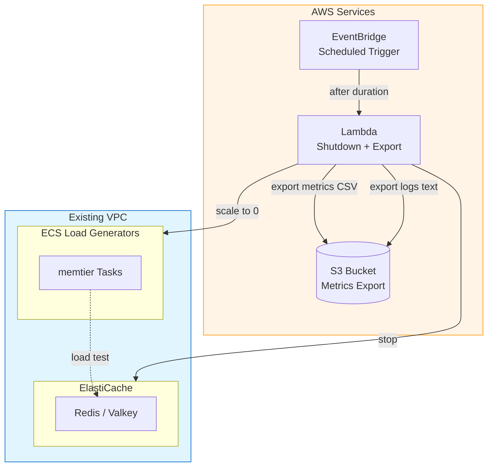

# AWS ElastiCache Performance Testing Infrastructure

This repository contains Terraform code to provision **ephemeral** AWS ElastiCache resources (Redis/Valkey) for performance testing and network throughput analysis.

The idea is simple:

> `terraform apply` → auto-run load tests → auto-export metrics → auto-stop infrastructure → `terraform destroy`.

Nothing in this stack is meant to be long-lived; you spin it up when you want to run a benchmark campaign and then tear it down.

---

## ⚠️ IMPORTANT: S3 Bucket Required

> **`metrics_export_s3_bucket` is REQUIRED.** Terraform will error if not configured.
>
> Create an S3 bucket before running `terraform apply`:
> ```bash
> aws s3 mb s3://my-elasticache-perf-exports
> ```

---

## 🎯 Project Goals

- **Performance Testing**  
  Provision ElastiCache configurations (engine, topology, instance type) to test how they behave under synthetic workloads.

- **Automated Lifecycle**  
  After `terraform apply`:
  1. Load tests start automatically
  2. Run for configurable duration (default: 1 hour)
  3. Export metrics (CSV) and logs (text) to S3
  4. Stop ECS and ElastiCache

- **Observability**  
  CloudWatch dashboards and log groups for real-time monitoring.

---

## 📋 Prerequisites

- **Terraform**: >= 1.0  
- **AWS CLI**: configured with appropriate credentials  
- **Existing VPC**: VPC + private subnets  
- **S3 Bucket**: for metrics export (REQUIRED)

---

## 🏗️ Architecture Overview



---

## 🔧 Monitoring Test Runs

After `terraform apply`:

1. **Monitor**: CloudWatch Dashboard (`terraform output cloudwatch_dashboard_url`)
2. **Wait**: Test runs for `test_duration_minutes` (default: 60)
3. **Auto-export**: Metrics and logs exported to S3
4. **Auto-stop**: ECS and ElastiCache stopped

### Export Format

| Data | Format | Location |
|------|--------|----------|
| CloudWatch Metrics | CSV | `s3://{bucket}/exports/metrics/{date}.csv` |
| memtier Logs | Plain text | `s3://{bucket}/exports/logs/{date}.txt` |

---

## 🧹 Cleanup

After tests complete, run:

```bash
terraform destroy
```

