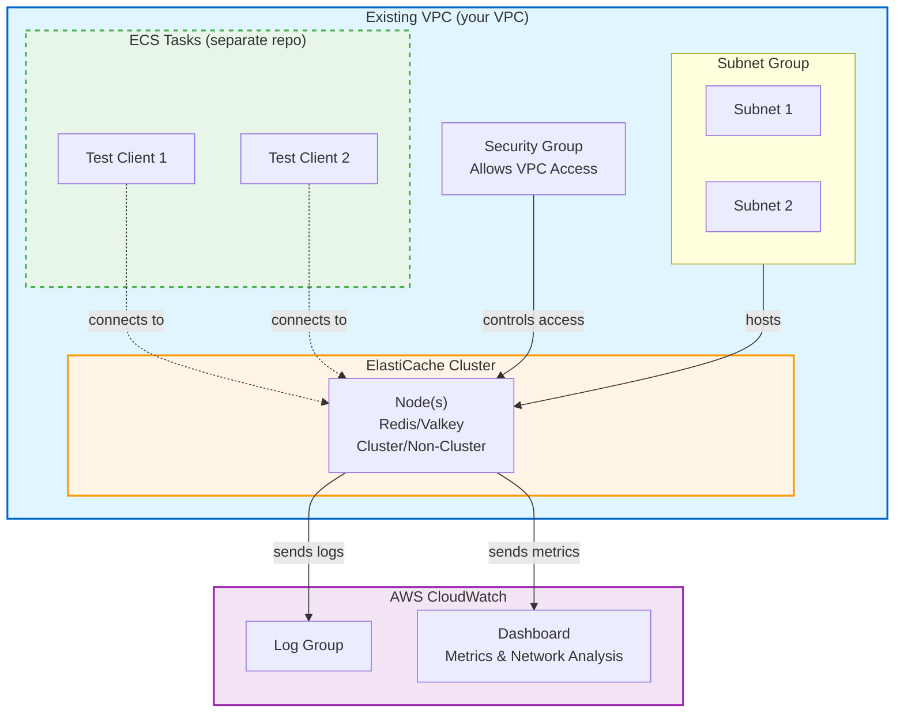

# AWS ElastiCache Performance Testing Infrastructure

This repository contains Terraform code to provision AWS ElastiCache resources (Redis/Valkey) for performance testing and network throughput analysis. The infrastructure is designed to be parameterized, allowing easy switching between different configurations to compare performance characteristics.

## 🎯 Project Goals

- **Performance Testing**: Provision ElastiCache clusters with various configurations to test performance under different load patterns
- **Network Analysis**: Compare actual network throughput (ingress/egress) against AWS documented limits for different instance types
- **Cost Optimization**: Start with minimal resources (cheapest instances) and scale up as needed
- **Flexibility**: Support both Redis and Valkey engines, cluster and non-cluster modes
- **Observability**: CloudWatch dashboards to visualize key metrics for analysis and blog content

## 📋 Prerequisites

- **Terraform**: >= 1.0
- **AWS CLI**: Configured with appropriate credentials
- **Existing VPC**: You must have a VPC with subnets already provisioned
- **AWS Region**: Default is `us-east-1` (cheapest for testing)

## 🏗️ Architecture Overview



Your ECS test clients (managed separately) will connect to the ElastiCache endpoints from within the same VPC.

## ⚙️ Configuration Parameters

Key Terraform variables you can configure:

| Parameter | Description | Default | Examples |
|-----------|-------------|---------|----------|
| `engine_type` | Cache engine | `redis` | `redis`, `valkey` |
| `engine_version` | Engine version | `7.1` | `7.1`, `7.2` |
| `node_type` | Instance type | `cache.t4g.micro` | `cache.t4g.micro`, `cache.r7g.large` |
| `cluster_mode_enabled` | Enable cluster mode | `false` | `true`, `false` |
| `num_cache_nodes` | Number of nodes (non-cluster) | `1` | `1`, `2`, `3` |
| `num_node_groups` | Number of shards (cluster mode) | `1` | `1`, `2`, `3` |
| `replicas_per_node_group` | Replicas per shard | `0` | `0`, `1`, `2` |
| `vpc_id` | Existing VPC ID | Required | `vpc-xxxxx` |
| `subnet_ids` | List of subnet IDs | Required | `["subnet-xxx", "subnet-yyy"]` |
| `parameter_group_settings` | Custom Redis/Valkey parameters | `{}` | Memory, eviction policies, etc. |

## 🚀 Quick Start

### 1. Clone and Configure

```bash
git clone https://github.com/the-smallest-coder/tests-aws-elasticache-redis.git
cd tests-aws-elasticache-redis
```

### 2. Create `terraform.tfvars`

```hcl
# Required parameters
vpc_id     = "vpc-0123456789abcdef"
subnet_ids = ["subnet-111111", "subnet-222222"]

# Optional - start with defaults, adjust as needed
engine_type           = "redis"
node_type            = "cache.t4g.micro"
cluster_mode_enabled = false
num_cache_nodes      = 1
```

### 3. Initialize Terraform

```bash
terraform init
```

### 4. Plan and Review

```bash
terraform plan
```

### 5. Deploy

```bash
terraform apply
```

## 📊 CloudWatch Dashboard

The Terraform code provisions a CloudWatch dashboard with the following metrics:

### Primary Metrics
- **Network Throughput**: Ingress/egress traffic with automatic AWS limit comparison
- **Max CPU Usage**: Peak and average CPU utilization
- **Max Memory Usage**: Peak memory consumption and swap usage

### Additional Performance Metrics
- **Cache Hit Rate**: Successful key lookups vs total lookups
- **Evictions**: Number of evicted keys
- **Connections**: Current and new client connections
- **Commands Processed**: Operations per second by type (GET, SET, Hash, List, etc.)
- **Replication Lag**: For clusters with replicas
- **Memory Fragmentation**: Memory efficiency
- **Current Items**: Total keys stored

> **Note**: The dashboard can be extended from your test client repositories to include client-side latency and throughput metrics.

## 🔍 Outputs

After `terraform apply`, you'll receive:

| Output | Description | Usage |
|--------|-------------|-------|
| `elasticache_endpoint` | Primary endpoint URL | Connection string for clients |
| `elasticache_port` | Port number | Default: 6379 |
| `elasticache_cluster_id` | Cluster/replication group ID | AWS resource identifier |
| `security_group_id` | Security group ID | Add to ECS task security groups |
| `cloudwatch_dashboard_url` | Dashboard link | Direct link to metrics |
| `configuration_summary` | Applied configuration | Quick reference |

## 🧪 Testing Workflow

### Load Patterns

Your test clients will apply various load patterns:
- **Read-heavy**: Primarily GET operations to test read throughput
- **Write-heavy**: Primarily SET operations to test write throughput  
- **Mixed workload**: Combination of reads and writes
- **Overtime load switching**: Dynamically switching between patterns to test adaptability

### Typical Test Cycle

1. **Start with baseline configuration**
   ```bash
   # Non-cluster, single node, smallest instance
   terraform apply -var="cluster_mode_enabled=false" -var="node_type=cache.t4g.micro"
   ```

2. **Run your performance tests** (from separate ECS test client repository)
   - Apply various load patterns
   - Monitor CloudWatch dashboard in real-time
   - Dashboard automatically shows actual throughput vs AWS limits

3. **Analyze results**
   - Dashboard shows network throughput in both MB/s and Gbps
   - Horizontal annotations display AWS network limits for your instance type
   - Compare actual performance against theoretical limits

4. **Test next configuration**
   ```bash
   # Switch to cluster mode
   terraform apply -var="cluster_mode_enabled=true" -var="num_node_groups=2"
   ```

5. **Test Valkey**
   ```bash
   # Switch engine (requires re-creation)
   terraform apply -var="engine_type=valkey"
   ```

6. **Scale up resources** (optional, for later testing)
   ```bash
   terraform apply -var="node_type=cache.r7g.large"
   ```

### Performance Comparison Checklist

- [ ] Non-cluster mode, single node (baseline)
- [ ] Non-cluster mode with replicas
- [ ] Cluster mode enabled (sharded)
- [ ] Redis vs Valkey comparison
- [ ] Network throughput vs AWS limits (automated in dashboard)
- [ ] Different instance types (t4g, r7g, etc.)
- [ ] Various load patterns (read-heavy, write-heavy, mixed)

## � Cost Tracking and Estimation

### Cost Factors

- **ElastiCache Instances**: Hourly rate based on node type and number of nodes
- **Data Transfer**: Outbound data transfer costs (inbound is free)
- **Backup Storage**: If snapshot retention is enabled (disabled by default for testing)
- **CloudWatch**: Dashboard and log storage (minimal cost)

### Estimated Costs (us-east-1)

| Instance Type | Hourly Cost | Daily Cost (24h) | Monthly Cost (~730h) |
|---------------|-------------|------------------|---------------------|
| cache.t4g.micro | ~$0.016 | ~$0.38 | ~$12 |
| cache.t4g.small | ~$0.032 | ~$0.77 | ~$23 |
| cache.t4g.medium | ~$0.064 | ~$1.54 | ~$47 |
| cache.r7g.large | ~$0.209 | ~$5.02 | ~$153 |
| cache.r7g.xlarge | ~$0.418 | ~$10.03 | ~$305 |

> **Tip**: Always `terraform destroy` when not actively testing to minimize costs.

### Cost Management Recommendations

1. **Start small**: Begin with `cache.t4g.micro` for initial testing
2. **Destroy when idle**: Use `terraform destroy` between test sessions
3. **Monitor spend**: Set up AWS Budget alerts for your testing account
4. **Test efficiently**: Plan test runs to maximize learning per dollar spent

## 🧹 Cleanup

To destroy all resources:

```bash
terraform destroy
```

> **Warning**: This will delete the ElastiCache cluster and all associated data.

## 📝 Future Enhancements

- [ ] Automated test result collection
- [ ] Performance regression testing
- [ ] Multi-region comparison
- [ ] Enhanced parameter group configurations

## 📚 Resources

- [AWS ElastiCache for Redis Documentation](https://docs.aws.amazon.com/elasticache/redis/)
- [AWS ElastiCache for Valkey Documentation](https://docs.aws.amazon.com/elasticache/valkey/)
- [ElastiCache Instance Types](https://aws.amazon.com/elasticache/pricing/)
- [Redis Commands Reference](https://redis.io/commands/)

## 📄 License

BSD 3-Clause License

## 🤝 Contributing

This is a performance testing infrastructure repository. Test results and configuration improvements are welcome!

---

**Note**: This repository focuses solely on ElastiCache infrastructure provisioning. Test clients and workload generation are managed in separate repositories.
