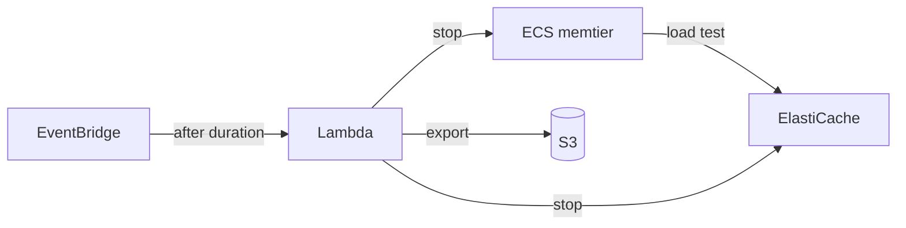

# AWS ElastiCache Performance Testing Infrastructure

Terraform infrastructure for **automated** ElastiCache (Redis/Valkey) performance testing.

> `terraform apply` → auto-run load tests → auto-export metrics → auto-stop → `terraform destroy`

---

## 🚀 Quick Start

```bash
# 1. Create S3 bucket for exports (REQUIRED)
aws s3 mb s3://my-elasticache-perf-exports

# 2. Configure
cp terraform.tfvars.example terraform.tfvars
# Edit: vpc_id, subnet_ids, metrics_export_s3_bucket

# 3. Deploy
terraform init
terraform apply

# 4. Cleanup (after test auto-completes)
terraform destroy
```

> ⚠️ **`metrics_export_s3_bucket` is required** - Terraform will error if not set.

---

## 📋 Prerequisites

- Terraform >= 1.0
- AWS CLI configured
- Existing VPC + private subnets
- S3 bucket for exports

---

## 🎯 What It Does

1. **Provisions** ElastiCache (Redis/Valkey) + ECS load generators
2. **Runs** memtier_benchmark for configurable duration (default: 1 hour)
3. **Exports** metrics (CSV) + logs (text) to S3
4. **Stops** ECS and ElastiCache automatically

---

## 🏗️ Architecture



---

## � Exports

| Data | Format | Path |
|------|--------|------|
| Metrics | CSV | `s3://{bucket}/exports/{timestamp}/metrics/{cluster}.csv` |
| Logs | Text | `s3://{bucket}/exports/{timestamp}/logs/{cluster}.txt` |

---

## 🔧 Configuration

Key variables in `terraform.tfvars`:

| Variable | Default | Description |
|----------|---------|-------------|
| `test_duration_minutes` | 60 | Minutes before auto-shutdown |
| `loadgen_task_count` | 1 | ECS tasks (scale factor) |
| `node_type` | cache.t4g.micro | ElastiCache instance |
| `engine_type` | redis | redis or valkey |

See `terraform.tfvars.example` for all options.
