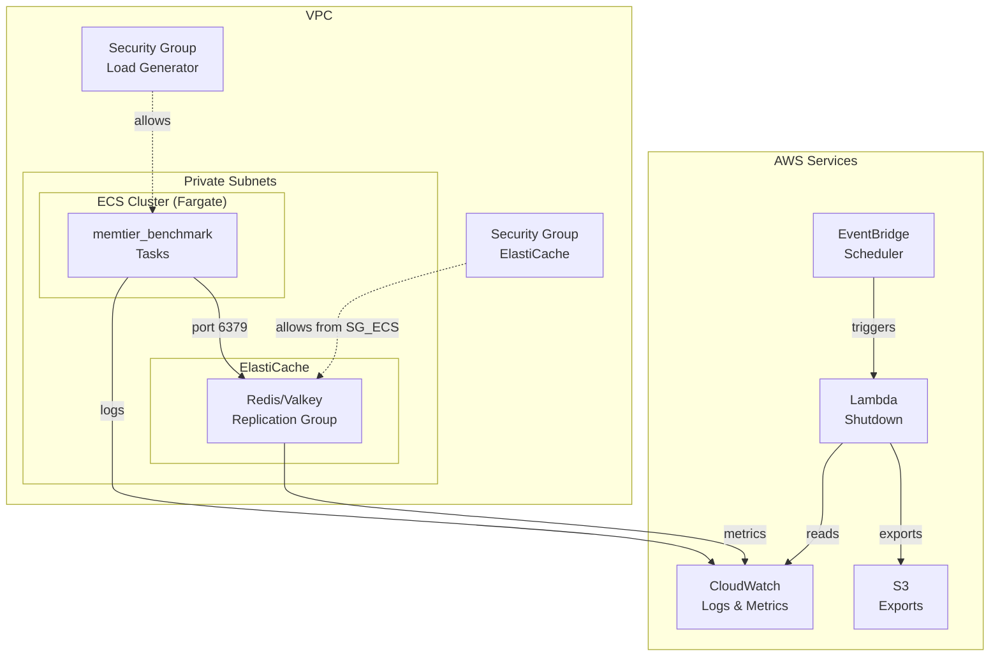
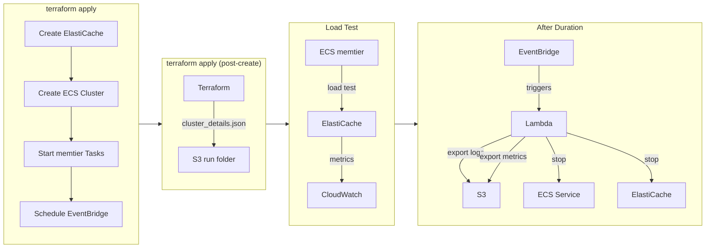

# AWS ElastiCache Performance Testing Infrastructure

Terraform infrastructure for **automated** ElastiCache (Redis/Valkey) performance testing.

> `terraform apply` → auto-run load tests → auto-export metrics → auto-stop → `terraform destroy`

---

## 🚀 Quick Start

```bash
# 1. Create S3 bucket for exports (REQUIRED)
aws s3 mb s3://my-elasticache-perf-exports

# 2. Configure
cp terraform.tfvars.example terraform.tfvars
# Edit: vpc_id, subnet_ids, metrics_export_s3_bucket

# 3. Deploy
terraform init
terraform apply

# 4. Cleanup (after test auto-completes)
terraform destroy
```

> ⚠️ **`metrics_export_s3_bucket` is required** - Terraform will error if not set.

---

## 📋 Prerequisites

- Terraform >= 1.0
- AWS CLI configured
- Existing VPC + private subnets
- S3 bucket for exports

---

## 🎯 What It Does

1. **Provisions** ElastiCache (Redis/Valkey) + ECS load generators
2. **Uploads** `cluster_details.json` to S3 immediately after apply — full configuration snapshot before the test starts
3. **Runs** memtier_benchmark for configurable duration (default: 1 hour)
4. **Exports** metrics (CSV) + logs (text) to S3 in the same run folder
5. **Stops** ECS and ElastiCache automatically

---

## 🏗️ Architecture


```mermaid
flowchart TB
    subgraph VPC["VPC"]
        subgraph Subnets["Private Subnets"]
            subgraph ECS_Cluster["ECS Cluster (Fargate)"]
                ECS_Tasks["memtier_benchmark<br/>Tasks"]
            end
            subgraph ElastiCache_Cluster["ElastiCache"]
                Redis["Redis/Valkey<br/>Replication Group"]
            end
        end
        SG_ECS["Security Group<br/>Load Generator"]
        SG_EC["Security Group<br/>ElastiCache"]
    end
    
    subgraph AWS_Services["AWS Services"]
        EventBridge["EventBridge<br/>Scheduler"]
        Lambda["Lambda<br/>Shutdown"]
        CloudWatch["CloudWatch<br/>Logs & Metrics"]
        S3["S3<br/>Exports"]
    end
    
    ECS_Tasks -->|"port 6379"| Redis
    SG_ECS -.->|allows| ECS_Tasks
    SG_EC -.->|allows from SG_ECS| Redis
    ECS_Tasks -->|logs| CloudWatch
    Redis -->|metrics| CloudWatch
    EventBridge -->|triggers| Lambda
    Lambda -->|reads| CloudWatch
    Lambda -->|exports| S3
```

---

## 🔄 Workflow


```mermaid
flowchart LR
    subgraph Start["terraform apply"]
        S1[Create ElastiCache] --> S2[Create ECS Cluster]
        S2 --> S3[Start memtier Tasks]
        S3 --> S4[Schedule EventBridge]
    end
    
    subgraph Run["Load Test"]
        R1[ECS memtier] -->|load test| R2[ElastiCache]
        R2 -->|metrics| R3[CloudWatch]
    end
    
    subgraph Stop["After Duration"]
        T1[EventBridge] -->|triggers| T2[Lambda]
        T2 -->|export logs| T3[S3]
        T2 -->|export metrics| T3
        T2 -->|stop| T4[ECS Service]
        T2 -->|stop| T5[ElastiCache]
    end

    subgraph Details["terraform apply (post-create)"]
        D1[Terraform] -->|cluster_details.json| D2[S3 run folder]
    end
    
    Start --> Details --> Run --> Stop
```

---

## 📦 Exports

All artefacts share a single deterministic run folder (`YYYYMMDD-HHmmss`) fixed at `terraform apply` time.

| Data | Format | Path |
|------|--------|------|
| **Cluster Details** | JSON | `s3://{bucket}/{prefix}{run_folder}/cluster_details.json` |
| ElastiCache Metrics | CSV | `s3://{bucket}/{prefix}{run_folder}/metrics/{cluster}.csv` |
| ECS Task Metrics | CSV | `s3://{bucket}/{prefix}{run_folder}/metrics/{cluster}-ecs.csv` |
| Logs (memtier) | Text | `s3://{bucket}/{prefix}{run_folder}/logs/{cluster}.txt` |
| Logs (ElastiCache) | Text | `s3://{bucket}/{prefix}{run_folder}/logs/elasticache/{cluster}.txt` |
| Logs (Container Insights) | Text | `s3://{bucket}/{prefix}{run_folder}/logs/container-insights/{cluster}.txt` |

> `run_folder` is also exposed as `terraform output run_folder` while the stack is live.

### cluster_details.json

Uploaded to S3 by Terraform **immediately after the cluster is created**, before the load test begins. Contains a complete snapshot of everything that could explain a performance difference between runs: ElastiCache engine/node/encryption/parameter settings, resolved live endpoints, full memtier configuration (including the computed `key_maximum`), ECS task resources, and the node memory reference table.

Because the cluster is destroyed after each test, this file is the only permanent record of the live resource configuration.

---

## 🔧 Configuration

Key variables in `terraform.tfvars`:

| Variable | Default | Description |
|----------|---------|-------------|
| `test_duration_minutes` | 60 | Minutes before auto-shutdown |
| `loadgen_task_count` | 1 | ECS tasks (scale factor) |
| `node_type` | `cache.t4g.micro` | ElastiCache instance type |
| `engine_type` | `redis` | `redis` or `valkey` |
| `loadgen_memtier_key_maximum` | `0` | Key-space upper bound. `0` = auto-compute from node memory and `loadgen_memtier_data_size` (fills cache to 85% capacity) |
| `loadgen_memtier_data_size` | `32` | Value size in bytes for SET operations |
| `loadgen_memtier_ratio` | `1:10` | SET:GET ratio |
| `loadgen_memtier_key_pattern` | `R:R` | Key access pattern (`R:R` random, `S:S` sequential, `G:G` gaussian) |

See `terraform.tfvars.example` for all options.

### Auto key_maximum

When `loadgen_memtier_key_maximum = 0` (the default), Terraform computes the key-space from the target node's usable memory:

```
key_maximum = floor(node_memory_bytes × 0.85 / (data_size + 70))
```

The 70-byte overhead accounts for Redis key and object metadata. This ensures the cache is warm (≈85% full) and reads hit existing keys rather than producing cache misses. The computed value is recorded in `cluster_details.json` alongside `key_maximum_auto: true` so you always know exactly what was used.

---

## 📧 Email Notification (Optional)

Receive email notifications when tests start, complete, or if resources fail to shut down.

### Prerequisites

1. **Verify an email address or domain in SES**:
   ```bash
   # Option 1: Verify a single email address (simplest)
   aws ses verify-email-identity --email-address aws@example.com
   
   # Option 2: Verify entire domain (requires DNS records)
   aws ses verify-domain-identity --domain example.com
   ```

2. **Get the SES Identity ARN**:
   ```bash
   # List verified identities
   aws sesv2 list-email-identities
   
   # Get ARN for specific identity
   aws sesv2 get-email-identity --email-identity aws@example.com
   
   # ARN format: arn:aws:ses:{region}:{account}:identity/{email-or-domain}
   ```

3. **SES Sandbox Mode**: New AWS accounts have SES in sandbox mode—only verified addresses can receive email. [Request production access](https://docs.aws.amazon.com/ses/latest/dg/request-production-access.html) to send to any address.

### Configuration

Add to `terraform.tfvars`:

```hcl
notification_email            = "your-email@example.com"
notification_ses_identity_arn = "arn:aws:ses:us-east-1:123456789012:identity/aws@example.com"
```

**Both variables must be set together.** Leave both empty to disable notifications.

### Notifications Sent

- **Test Started**: When ECS tasks begin running
- **Test Complete**: After shutdown and export operations finish
- **Verification Warning**: If resources are still running 15 minutes after scheduled shutdown
- **Verification OK**: If all resources successfully shut down

---

## 🛠️ Helper Scripts

Bash scripts in `scripts/` for monitoring and retrieving results. Run from WSL or any bash shell with AWS CLI configured.

### Check Status

Shows current test phase, resource states, and time remaining:

```bash
./scripts/check_status.sh              # quick status
./scripts/check_status.sh --detailed   # verbose (per-node, per-task details)
```

Displays:
- ElastiCache cluster status
- ECS load generator tasks (count, per-task status, elapsed time)
- Reporter task status
- Shutdown schedule with countdown
- S3 results summary (file counts by type)
- Overall phase: STARTING → RUNNING → SHUTTING DOWN → CLEANUP → COMPLETE

### Download Results

Downloads exported metrics, logs, and HTML reports to a local folder:

```bash
./scripts/download_results.sh                          # download everything to ./results/
./scripts/download_results.sh --reports-only            # just HTML reports
./scripts/download_results.sh --latest                  # most recent run only
./scripts/download_results.sh --output-dir ./my-results # custom destination
```

Options can be combined:

```bash
./scripts/download_results.sh --latest --reports-only
```

### Requirements

- **bash**, **jq**, **AWS CLI** configured with access to the S3 bucket
- Run from the project root (scripts read config via `terraform output`)
