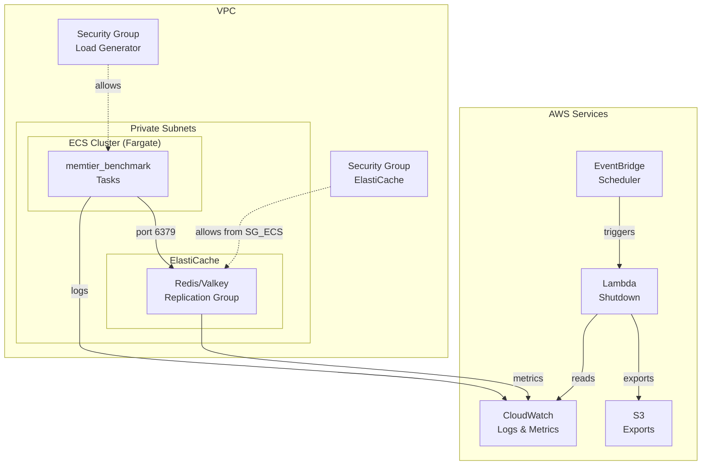
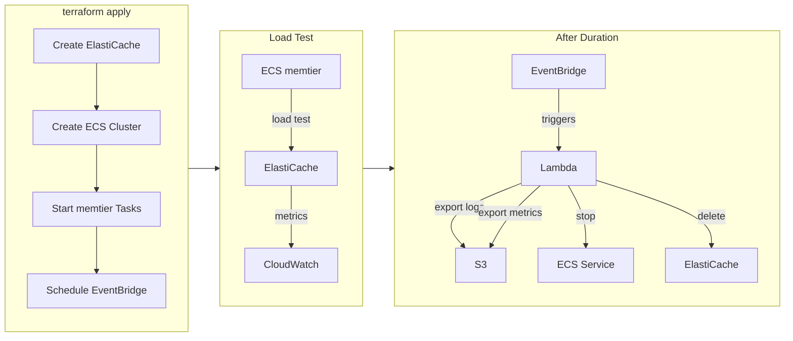

# AWS ElastiCache Performance Testing Infrastructure

Terraform infrastructure for **automated** ElastiCache (Redis/Valkey) performance testing.

> `terraform apply` → auto-run load tests → auto-export metrics → auto-cleanup → `terraform destroy`

---

## 🚀 Quick Start

```bash
# 1. Create S3 bucket for exports (REQUIRED)
aws s3 mb s3://my-elasticache-perf-exports

# 2. Configure
cp terraform.tfvars.example terraform.tfvars
# Edit: vpc_id, subnet_ids, metrics_export_s3_bucket

# 3. Deploy
terraform init
terraform apply

# 4. Cleanup (after test auto-completes)
terraform destroy
```

> ⚠️ **`metrics_export_s3_bucket` is required** - Terraform will error if not set.

---

## 📋 Prerequisites

- Terraform >= 1.0
- AWS CLI configured
- Existing VPC + private subnets
- S3 bucket for exports

---

## 🎯 What It Does

1. **Provisions** ElastiCache (Redis/Valkey) + ECS load generators
2. **Runs** memtier_benchmark for configurable duration (default: 1 hour)
3. **Exports** metrics (CSV) + logs (text) to S3
4. **Cleans up** by stopping ECS and deleting the ElastiCache replication group

---

## 🏗️ Architecture


```mermaid
flowchart TB
    subgraph VPC["VPC"]
        subgraph Subnets["Private Subnets"]
            subgraph ECS_Cluster["ECS Cluster (Fargate)"]
                ECS_Tasks["memtier_benchmark<br/>Tasks"]
            end
            subgraph ElastiCache_Cluster["ElastiCache"]
                Redis["Redis/Valkey<br/>Replication Group"]
            end
        end
        SG_ECS["Security Group<br/>Load Generator"]
        SG_EC["Security Group<br/>ElastiCache"]
    end
    
    subgraph AWS_Services["AWS Services"]
        EventBridge["EventBridge<br/>Scheduler"]
        Lambda["Lambda<br/>Shutdown"]
        CloudWatch["CloudWatch<br/>Logs & Metrics"]
        S3["S3<br/>Exports"]
    end
    
    ECS_Tasks -->|"port 6379"| Redis
    SG_ECS -.->|allows| ECS_Tasks
    SG_EC -.->|allows from SG_ECS| Redis
    ECS_Tasks -->|logs| CloudWatch
    Redis -->|metrics| CloudWatch
    EventBridge -->|triggers| Lambda
    Lambda -->|reads| CloudWatch
    Lambda -->|exports| S3
```

---

## 🔄 Workflow


```mermaid
flowchart LR
    subgraph Start["terraform apply"]
        S1[Create ElastiCache] --> S2[Create ECS Cluster]
        S2 --> S3[Start memtier Tasks]
        S3 --> S4[Schedule EventBridge]
    end
    
    subgraph Run["Load Test"]
        R1[ECS memtier] -->|load test| R2[ElastiCache]
        R2 -->|metrics| R3[CloudWatch]
    end
    
    subgraph Stop["After Duration"]
        T1[EventBridge] -->|triggers| T2[Lambda]
        T2 -->|export logs| T3[S3]
        T2 -->|export metrics| T3
        T2 -->|stop| T4[ECS Service]
        T2 -->|delete| T5[ElastiCache]
    end
    
    Start --> Run --> Stop
```

---

## 📦 Exports

| Data | Format | Path |
|------|--------|------|
| ElastiCache Metrics | CSV | `s3://{bucket}/exports/{timestamp}/metrics/{cluster}.csv` |
| ECS Task Metrics | CSV | `s3://{bucket}/exports/{timestamp}/metrics/{cluster}-ecs.csv` |
| Loadgen logs | Text | `s3://{bucket}/exports/{timestamp}/logs/loadgen/{stream}.txt` |

---

## 🔧 Configuration

Key variables in `terraform.tfvars`:

| Variable | Default | Description |
|----------|---------|-------------|
| `test_duration_minutes` | 60 | Minutes before auto-shutdown |
| `loadgen_task_count` | 1 | ECS tasks (scale factor) |
| `node_type` | cache.t4g.micro | ElastiCache instance |
| `engine_type` | redis | redis or valkey |

See `terraform.tfvars.example` for all options.

Load generator tasks use per-task key prefixes to avoid overlapping writes. If `loadgen_memtier_key_maximum` is set, that key maximum applies per task.

---

## 📧 Email Notification (Optional)

Receive email notifications when tests start, complete, or if resources fail to shut down.

### Prerequisites

1. **Verify an email address or domain in SES**:
   ```bash
   # Option 1: Verify a single email address (simplest)
   aws ses verify-email-identity --email-address aws@example.com
   
   # Option 2: Verify entire domain (requires DNS records)
   aws ses verify-domain-identity --domain example.com
   ```

2. **Get the SES Identity ARN**:
   ```bash
   # List verified identities
   aws sesv2 list-email-identities
   
   # Get ARN for specific identity
   aws sesv2 get-email-identity --email-identity aws@example.com
   
   # ARN format: arn:aws:ses:{region}:{account}:identity/{email-or-domain}
   ```

3. **SES Sandbox Mode**: New AWS accounts have SES in sandbox mode—only verified addresses can receive email. [Request production access](https://docs.aws.amazon.com/ses/latest/dg/request-production-access.html) to send to any address.

### Configuration

Add to `terraform.tfvars`:

```hcl
notification_email            = "your-email@example.com"
notification_ses_identity_arn = "arn:aws:ses:us-east-1:123456789012:identity/aws@example.com"
```

**Both variables must be set together.** Leave both empty to disable notifications.

### Notifications Sent

- **Test Started**: When ECS tasks begin running
- **Test Complete**: After shutdown and export operations finish
- **Verification Warning**: If resources are still running 15 minutes after scheduled shutdown
- **Verification OK**: If all resources successfully shut down

---

## Local Comparison

The same `reporter/report_generator.py` entrypoint is used in ECS and for local comparison.

## Multiple Disposable Runs

For serial batches of disposable test runs, use the workspace-based helper in
[`multirun/`](multirun/README.md). It keeps the root Terraform workflow
unchanged while creating one Terraform workspace and one per-run tfvars file for
each configured run.

### Report Window

Reports and plots use one absolute memtier log message window across all memtier streams:

- **Start time**: timestamp of the very first memtier log message.
- **End time**: timestamp of the very last memtier log message.

Every plotted value is placed at the absolute timestamp from its source log or metric row.

### Load-generator validity

The report validates one run at task and AZ granularity before its latency results are used:

- `loadgen.generator_cpu_p95_pct` is the maximum of the per-task p95 values of
  `CpuUtilized / CpuReserved * 100`. Only `Average` task records inside the report
  window are used, and zero-utilization shutdown samples are excluded. A value
  above 85% sets `loadgen.latency_tail_valid` to `false` -- the run's latency/tail
  conclusions are not trustworthy -- and adds `generator_cpu_p95_above_85_pct` to
  `loadgen.warning_reasons`. `loadgen.diagnostic_status` becomes `"warning"`, not
  `"invalid"`: a CPU-bound load generator doesn't invalidate the ElastiCache-side
  measurements, only conclusions drawn from ECS task latency.
  `loadgen.generator_cpu_across_tasks` reports the min, median, and max across
  those per-task p95 values; it does not use ramp-up minima from the time series.
- `loadgen.throughput_task_skew_p90_to_p10` is computed across per-task medians of
  the leading, current `ops/sec` value in memtier progress records. The cumulative
  `(avg: ...)` value and final `Totals` rows are not used for this metric.
- `loadgen.throughput_skew_within_az_max` is the worst per-AZ p90/p10 ratio. A
  value above 1.3 marks a generator problem inside an AZ (adds
  `throughput_skew_within_az_above_1_3` to `loadgen.warning_reasons`, same
  `"warning"` severity as above). The max/min ratio of AZ median throughputs is
  reported separately without a validity threshold.

Only full UTC minute buckets wholly contained in the absolute report window are
eligible. Eligible minutes where fewer than the expected number of memtier tasks
are present are also excluded. The discarded boundary and missing-task counters
are mutually exclusive; `minutes_below_expected_task_count` remains a separate
overlapping diagnostic. Expected task count is the mode of
`RunningTaskCount`, with the number of memtier streams as fallback. The exporter
adds `AvailabilityZone` to task-level
ECS CSV dimensions; downloaded historical runs can recover the same mapping from
`logs/container-insights/*.txt` through the literal `TaskId` match.

If any task lacks an AZ mapping, within-AZ and between-AZ gates are not computed,
the report records `availability_zone_missing`, and `loadgen.diagnostic_status`
remains `"unknown"` unless another independent gate above already makes it
`"warning"` (a warning takes precedence over unknown).

With only 6 or 9 tasks, p90/p10 is close to max/min. It is retained as a compact
skew indicator, while the per-task vector and per-AZ breakdown remain the primary
evidence in the report.

For local comparison:

```bash
reporter/.venv/Scripts/python.exe reporter/report_generator.py compare \
  results/20260227-140039 \
  results/20260307-093716
```

You can also omit `compare`; two positional paths are treated as comparison input.
The output defaults to `results/comparisons/<baseline>_vs_<candidate>.html`.
